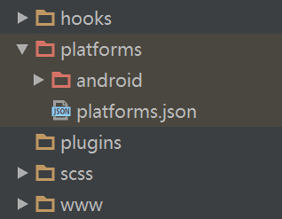
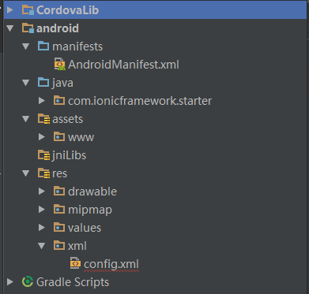
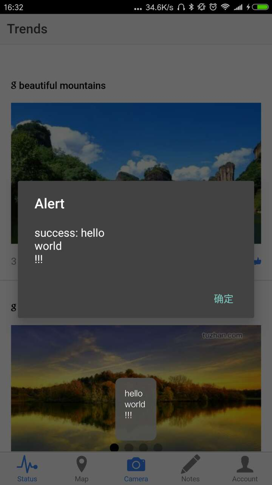
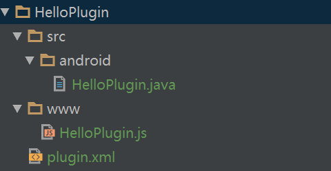
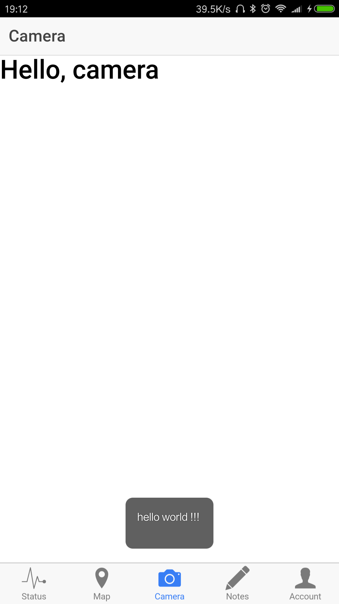

# ionic 环境下编写自定义cordova插件

## 1 增加android的平台

对于一个ionic项目，在主目录下通过以下命令行增加android平台。

```shell
cordova platform add android
```

然后在platforms目录下就会出现一个android文件夹：



之后可以使用配置了android开发环境的eclipse选中上图android目录打开该项目；也可以使用Android Studio打开上图android目录，这时候需要要配置gradle,直接选择确定下载即可（此时建议开启全局代理），注意项目的路径中不能含有非ascii码字符（例如中文），否则gradle会build失败。

本例使用Android Studio来演示，eclipse环境下只要找到对应的文件即可。

## 2 使用Android Studio开发插件源码

### 2.1 介绍项目目录

打开项目后，项目目录如下：



该项目有两个模块，第一个是CordovaLib，里面是cordova库的代码，我们就不用管了（如果是用eclipse打开这会显示为一个单独的项目）

第二个模块便是我们自己的项目了，就如普通的android项目目录一样。我们在项目主目录WWW目录下的代码都被原封不动的拷贝到assets/www目录下，又额外添加了一些cordova js库，这些文件我们也不用管。

### 2.2 开发插件源码

如下图，新建一个org.apache.cordova.hello包，改包名可随意取。然后在改包下新建一个HelloPlugin.java文件：


HelloPlugin的代码如下：

```java
package org.apache.cordova.hello;

import android.widget.Toast;
import org.apache.cordova.CallbackContext;
import org.apache.cordova.CordovaPlugin;
import org.json.JSONArray;
import org.json.JSONException;

/**
 * Created by duocai on 2017/4/10.
 */
//所有的自定义plugin都需要继承CordovaPlugin这个类
public class HelloPlugin extends CordovaPlugin {

  //然后需要复写这个execute方法
  @Override
  public boolean execute(String action, JSONArray args, CallbackContext callbackContext)
    throws JSONException {

    if (action.equals("hello")) {
      String text = "";
      for (int i = 0; i < args.length(); i++) {
        text += args.getString(i) + "\n"; //这取决于js代码传进来的参数类型。
      }
      Toast.makeText(this.cordova.getActivity(), text, Toast.LENGTH_LONG).show();
      callbackContext.success("success: " + text);//使用回掉的方法，返回信息
      //callbackContext.error("dd"); //对应有返回错误的方法
      return true;
    }

    return false;
  }
}

```

execute有三个参数，这个对应js的调用代码会更好理解（详见2.4部分）：

```javascript
cordova.exec(callbackContext.success, callbackContext.error, PluginName, action, args);
```

其中action就对应action；args在js端就是普通的js数组；callbackContext.success, callbackContext.error分别是成功和失败时的两个回掉函数，前面java代码中：

```java
callbackContext.success("success: " + text);//使用回掉的方法，返回信息
```

这一行就调用了第一个回掉函数。

PluginName的意义就是指定了当前的java文件（详见2.3本分）

### 2.3 在配置文件中配置HelloPlugin：

2.1的目录结构中，我们可以看到res/xml目录下有一个config.xml配置文件，打开文件增加配置如下：

```xml
<?xml version='1.0' encoding='utf-8'?>
<widget id="com.ionicframework.starter" version="0.0.1" xmlns="http://www.w3.org/ns/widgets" xmlns:cdv="http://cordova.apache.org/ns/1.0"> <!-- xmlns若是报找不到文件错误也不用管-->
    <name>HelloCordova</name>
    <description>
        An Ionic Framework and Cordova project.
    </description>
    <author email="you@example.com" href="http://example.com.com/">
      Your Name Here
    </author>
    <content src="index.html" />
    <access origin="*" />
    <preference name="loglevel" value="DEBUG" />
    <preference name="webviewbounce" value="false" />
    <preference name="UIWebViewBounce" value="false" />
    <preference name="DisallowOverscroll" value="true" />
    <preference name="SplashScreenDelay" value="2000" />
    <preference name="FadeSplashScreenDuration" value="2000" />
    <preference name="android-minSdkVersion" value="16" />
    <preference name="BackupWebStorage" value="none" />
    <!-- 前面为自动生成，含义由名字可以看出个大概>

    <!--新增配置文件 name="HelloPlugin"指定了js端调用时需要传递的PluginName参数-->
    <feature name="HelloPlugin">
      <!--value的值为刚刚开发的HelloPlugin文件的路径-->
      <param name="android-package" value="org.apache.cordova.hello.HelloPlugin" />
    </feature>

</widget>

```

### 2.4 通过js代码调用插件

```javascript
/**
 * Created by duocai on 2016/9/6.
 */
angular.module('ctrl.camera', [])

  .controller('CameraCtrl', function($scope) {
    success = function(data) {
      alert(data);
    }
    
    //参数与前面的java代码对应如下
    //js: cordova.exec(callbackContext.success, callbackContext.error, PluginName, action, args);
    //java: public boolean execute(String action, JSONArray args, CallbackContext callbackContext)
    // 此外 js 多余的 PluginName 在2.3的配置文件中配置
    //<feature name="HelloPlugin"> // PluginName
      //<param name="android-package" value="org.apache.cordova.hello.HelloPlugin" />
    //</feature>
    cordova.exec(success, null, "HelloPlugin", "hello", ["hello", "world", "!!!"]);
  });

```

其余没有注释的部分是angular controller的语法，就不再赘述。

至此就利用cordova的库完成了通过js代码调用原生java代码。

### 2.5  效果演示



其中下面小黑框是java代码的输出，上面大黑框是js代码的输出。

## 3 配置为符合ionic插件格式的插件

我们都知道使用在开发ionic项目时，是不需要上面那样在android studio中使用插件的。这是cordova 的插件进行了进一步的封装，知道了上面的过程后，我们就知道ionic的插件格式要求到底干了什么事。

在开发之前需要做一点准备，每次执行cordova build android 的时候，都会复写platforms/android目录下文件。所以我们将刚刚的android项目目录改名为android plugin development。然后在执行：

```shell
cordova platform add android
```

来增加 android 平台

### 3.1 插件目录

​	

按上图所示建一个插件目录。src和www无所谓怎么建，但这样建条理更清晰，plugin.xml一定要在其所在的位置。

### 3.2 各个文件内容

1.  HelloPlugin.java就是上面的文件直接拷贝过来即可

2.  plugin.xml:

    ```xml
    <?xml version="1.0" encoding="utf-8"?>
    <plugin id="org.cordova.HelloPlugin" version="0.0.1"
            xmlns="http://apache.org/cordova/ns/plugins/1.0"
            xmlns:android="http://schemas.android.com/apk/res/android">
      <name>HelloPlugin</name>
      <description>Description</description>

      <!-- js 部分 -->
      <!-- plugin 'org.cordova.HelloPlugin'(看上面id) 下 定义module HelloPlugin -->
      <!-- 配置后会将HelloPlugin.js配置到android项目assets/www/plugins 目录下，做了语法补充完整，
    	有兴趣可以自己打开看看 -->
      <js-module name="HelloPlugin" src="www/HelloPlugin.js">
        <clobbers target="HelloPlugin"/>
      </js-module>

      <!--android 部分就是
      1. 在第2部分提到的res/xml/config.xml添加plugin配置
      2. 将对应的文件拷贝到对应的目录下-->
      <platform name="android">
        <config-file parent="/*" target="res/xml/config.xml">
          <!--新增配置文件 name="HelloPlugin"指定了js端调用时需要传递的名称参数-->
          <feature name="HelloPlugin">
            <!--value的值为刚刚开发的HelloPlugin文件的路径-->
            <param name="android-package" value="org.apache.cordova.hello.HelloPlugin" />
          </feature>
        </config-file>
        <source-file src="src/android/HelloPlugin.java" target-dir="src/org/apache/cordova/hello"/>
      </platform>
    </plugin>
    ```


3.  HelloPlugin.js

    ```java
    /**
    * Created by admin on 2017/4/10.
    */
    var exec = require('cordova/exec');

     // 符合格式要求可在其它js文件中调用该模块
     module.exports = {

       show: function (message) {
      //基本上等同于前面第2部分所说的cordova.exec()
         exec(null,null, "HelloPlugin", "hello", [message]);
       }

     };
    ```

4.  调用插件，依然以前面的CameraCtrl为例

    ```javascript
      /**
    * Created by duocai on 2016/4/10.
    */
    angular.module('ctrl.camera', [])

     .controller('CameraCtrl', function($scope) {
       HelloPlugin.show("hello world !!!") // HelloPlugin在前面的plugin.xml里配置
     });
    ```

### 3.3 运行结果

   

## 4 进一步分析

1. 比较第二部分和第三部分，如果是要自己写插件的化，不如待到前端写的差不多了，然后直接转移到android studio项目来写，如第二部分那样扩展原生代码，并通过js调用。修改少量的js代码和html。这样做使得扩展功能变得简单，但是这样做的后果是没有多平台。
2. 比较第二部分和第三部分，可以得出js-module不是必须配置的，配置之后则可以使用cordova进一步封装的语法来调用。针对于自己的插件，我们可以直接调用cordova.exec(), 但是这样做的后果是模块不分离。

